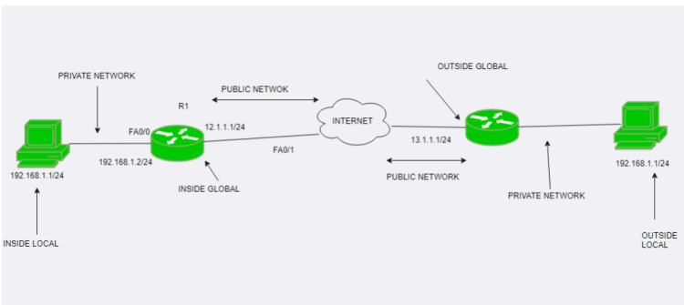

# Networking Overview

## IP Addressing and Subnetting

- `IP Address`: An IP address is a unique numerical identifier assigned to each device on a network. A 32-bit number represents an IPv4 address, for example, `192.168.1.1`. This address is used to identify devices and enable communication over the network.

- `Subnet Mask`: A subnet mask works alongside an IP address to define the network and host portions. For example, `255.255.255.0` specifies that the first 24 bits are the network part, while the last 8 bits define the host within that network.

- Manually assign an IP address and a subnet mask to eth0 network interface: `ifconfig eth0 192.168.1.1 netmask 255.255.255.0`.

## Conditions for Network Connectivity
For two systems to communicate over a network, the following conditions must be met:

- Both systems must have a valid IP address.
- They must have a physical connection (either wired or wireless).
- They should be on the same network (or subnetwork).
- Private IP addresses can only connect to other private IPs, while public IP addresses connect to other public IPs.

- `Checking Network Compatibility`: Convert both the IP address and subnet mask of each system to binary and apply the AND operation. If the results match for both systems, they are on the same network.

## Local Area Network (LAN)

- A Local Area Network (LAN) is a type of network that connects computers and devices within a limited geographical area, such as a home, office, or building. LANs enable devices like computers, printers, and servers to communicate and share resources such as files, internet access, and applications. Typically, a LAN can be wired (using Ethernet cables) or wireless (Wi-Fi).

- Key Characteristics of LAN:

    - Geographic Scope: Limited to small areas like homes, offices, or campuses.
    High Data Transfer Rates: LANs typically offer high-speed data transmission, ranging from 100 Mbps to several Gbps.
    - Ownership: Usually owned, managed, and maintained by a single organization or individual.
    - Common Protocols: LANs commonly use Ethernet as a protocol for wired connections and Wi-Fi for wireless connections.
    - Broadcast and Collision Domains: All devices within a LAN share the same broadcast domain, meaning that broadcast messages are sent to all devices within that LAN. Devices are connected in such a way that they can communicate directly without requiring a router.

- LAN Components:

    - Network Interface Cards (NICs): Devices use NICs to connect to the LAN, allowing them to communicate with other devices.
    - Switches: A switch connects devices within the same LAN and directs data to the correct destination based on MAC addresses.
    - Routers: A router connects the LAN to other networks, such as the internet or other LANs.
    - Cables: For wired LANs, Ethernet cables (such as Cat5e, Cat6) are used to physically connect devices.
    - Access Points (APs): For wireless LANs (WLANs), access points enable wireless devices to connect to the network.

- Types of LAN:

    - Wired LAN: This uses Ethernet cables and switches to connect devices.
    - Wireless LAN (WLAN): Uses wireless technologies (Wi-Fi) to connect devices. WLANs typically use access points (APs) to enable wireless communication.

## Subnetting:

- Subnetting is a technique used to divide a larger IP network (or block) into smaller, more manageable sub-networks, known as subnets. The main purpose of subnetting is to improve network performance and security by reducing the size of broadcast domains and organizing IP addresses logically.

- Why Subnetting is Important:

    - Efficient Use of IP Addresses: It helps conserve IP addresses by splitting larger networks into smaller segments that are more appropriate for the number of devices in each subnetwork.

    - Network Management: Subnetting simplifies network management by grouping devices into smaller, logical networks. This makes it easier to manage IP addressing, monitor traffic, and apply policies.

    - Reduced Broadcast Traffic: By breaking up a network into smaller subnets, broadcast traffic (which is sent to all devices within a network) is contained within each subnet, reducing unnecessary network congestion.

    - Enhanced Security: Subnetting allows administrators to isolate groups of devices, thereby creating boundaries that can help control access between subnets.

- How Subnetting Works:
    - Each IP address consists of two parts:
        - Network Portion: Identifies the specific network.
        - Host Portion: Identifies individual devices within that network.

- Subnetting modifies the network portion of the IP address to create smaller, more manageable subnetworks. This is done by manipulating the subnet mask, which defines how many bits are used for the network and how many for the host.

- Example:
    Consider the IP address 192.168.1.1 with the subnet mask 255.255.255.0. In this example:

    - The first 24 bits (255.255.255) represent the network portion.
    - The last 8 bits (.0) represent the host portion.
    - By changing the subnet mask (e.g., to 255.255.255.128), we can further divide the network into two smaller subnets. This reduces the number of available hosts in each subnet but improves the organization of the network.

- Subnet Mask Calculation:

    - A subnet mask is a 32-bit number used to separate the network and host portions of an IP address. For example, a subnet mask of 255.255.255.0 (written as /24 in CIDR notation) means that the first 24 bits of the IP address are used for the network, and the remaining 8 bits are used for host addresses.

    - Classful Subnetting: In classful networking, IP addresses were categorized into fixed classes (A, B, C) based on the number of hosts and networks. For example, Class C had a default subnet mask of 255.255.255.0, supporting up to 254 hosts.

    - Classless Inter-Domain Routing (CIDR): CIDR allows flexible allocation of IP addresses, enabling more efficient subnetting. CIDR notation specifies the number of bits used for the network portion of the IP address. For example, /24 means the first 24 bits are used for the network, and the remaining bits are for the hosts.

- Benefits of Subnetting:

    - Network Scalability: Allows the network to grow efficiently by creating subnets that can be allocated as needed.
    - Performance: Reduces broadcast traffic and prevents network slowdowns.
    - Security: Segmenting a network with subnets provides additional security boundaries, limiting access between devices.

## Router:

- A router is a crucial networking device that connects multiple networks together, allowing data to flow between different networks such as your home network and the internet. Operating at the Network Layer (Layer 3) of the OSI model, routers make intelligent decisions about where to send data based on the IP addresses of devices.

- Key Functions of a Router:

    - Routing:

        - The primary job of a router is to determine the optimal path for data packets to travel from the source device to the destination device. Routers maintain routing tables that contain information about different networks and the best routes to reach them.

        - When a router receives a data packet, it examines the packet's destination IP address and consults its routing table to determine the most efficient path for that packet.

    - Network Address Translation (NAT):

        - NAT is a method used by routers to allow multiple devices in a private network (such as your home LAN) to share a single public IP address when accessing the internet. This is essential because the number of public IP addresses is limited, and NAT conserves these addresses.

        - The router modifies the source IP address of outgoing packets from a private IP address (e.g., 192.168.0.2) to a public IP address (e.g., 203.0.113.5), allowing the devices to communicate with external networks.

    - Firewall:

        - Many modern routers also act as firewalls, filtering incoming and outgoing network traffic based on pre-configured security policies. The router inspects data packets and either blocks or permits them based on rules set by the administrator. This helps protect the internal network from unauthorized access or malicious traffic from external networks.

    - Interconnecting Networks:

        - Routers can interconnect networks that use different communication protocols, such as LANs and WANs (Wide Area Networks). They enable the transfer of data between these different networks by analyzing packet headers and directing them accordingly.

    - Example:

        - In a home network, the router connects your local devices (like your phone, laptop, and TV) to the internet. When you request a webpage, the router routes the data between your device and the internet.

## Switch:

- A switch is a device used in Local Area Networks (LANs) to connect multiple devices such as computers, printers, and servers. Operating at the Data Link Layer (Layer 2) of the OSI model, switches facilitate the transmission of data between devices on the same network by using MAC addresses (unique hardware addresses assigned to each network interface).

- Key Functions of a Switch:

    - Data Forwarding Using MAC Addresses:

        - Unlike a hub, which blindly forwards all data to all devices, a switch uses the MAC addresses of devices to forward data to the correct recipient. When a data packet arrives at the switch, it reads the destination MAC address and forwards the packet only to the port connected to the device with that MAC address. This minimizes unnecessary traffic and improves network efficiency.

    - Full-Duplex Communication:

        - Switches support full-duplex communication, meaning that data can be sent and received simultaneously between devices. This feature increases the overall bandwidth of the network and allows devices to communicate more efficiently.

    - Creating Virtual LANs (VLANs):

        - Many switches support the creation of VLANs, which are logical subdivisions of a physical network. VLANs allow administrators to segment the network into smaller, isolated sections, improving performance and security. For instance, a company can create separate VLANs for different departments (HR, IT, Sales), preventing unnecessary communication between them.

    - Redundancy and Link Aggregation:

        - Switches often support redundancy features like Spanning Tree Protocol (STP) to prevent loops in the network. They can also support link aggregation, where multiple connections between switches or devices are combined to increase bandwidth.

    - Example:
        - In a corporate environment, switches are commonly used to connect office computers and printers within the same building or floor, ensuring efficient communication and data sharing.

## Network Address Translation (NAT):

- Network Address Translation (NAT) is a technique used by routers to modify the IP address information in data packets as they pass through a router. NAT is especially important in scenarios where many devices on a local network (with private IP addresses) need to share a single public IP address to access external networks like the internet.

- There are two main types of NAT:

    - Source Network Address Translation (SNAT).
    - Destination Network Address Translation (DNAT).

- Source NAT (SNAT):

    - SNAT is a method where the source IP address in a data packet is modified as it leaves a private network to access an external network (like the internet). This technique allows devices in a local network, each with private IP addresses, to share a single public IP address when communicating with external hosts.

    - SNAT is typically used when internal devices initiate communication with external servers or services. The router modifies the packet's source IP address from a private one (like 192.168.1.10) to a public IP address, ensuring that the packet can be routed through the internet. When the external server responds, the router performs the reverse translation, replacing the public IP address with the original private one before forwarding it back to the internal device.

    - Example:
        - When your laptop with the private IP address 192.168.0.5 sends a request to access a website on the internet, the router changes the source IP address to its public IP address, say 203.0.113.10. The website's response is directed to this public IP, and the router forwards it back to your laptop after converting the IP address back to 192.168.0.5.

- Destination NAT (DNAT):

    - DNAT modifies the destination IP address of incoming packets. It is commonly used in scenarios like port forwarding, where external requests to a specific public IP address and port are redirected to an internal device with a private IP address.

    - DNAT is often used in web hosting and services. For instance, if a company hosts a web server behind a NAT router, the router can be configured to forward all incoming HTTP requests (port 80) from its public IP address to the private IP address of the web server.

    - Example:
        - If a user on the internet sends a request to 203.0.113.10 (public IP) on port 80 (HTTP), the router can be configured to forward the request to an internal web server at 192.168.0.2. The internal server receives the request, processes it, and the router forwards the response back to the user.

- Benefits of NAT:

    - IP Address Conservation: NAT allows multiple devices on a private network to share a single public IP address, conserving the limited number of public IPs available.
    - Security: By hiding internal IP addresses, NAT provides a layer of security, preventing external entities from directly accessing devices inside the network.
    - Simplified IP Addressing: NAT allows organizations to use private IP address ranges internally, simplifying network management.

### Network Diagram:

### DNS Server (Domain Name System Server):

- A DNS server is a system that translates human-readable domain names (like example.com) into machine-readable IP addresses (like 192.0.2.1). This process is known as DNS resolution, and it allows users to access websites using easy-to-remember domain names rather than IP addresses. DNS is critical for internet functionality, as it ensures that web browsers can locate and connect to web servers.

- The DNS system operates as a hierarchical, distributed database. When a DNS server receives a query, it follows a series of steps to resolve the domain name:

    - Root DNS Servers: At the top of the hierarchy, they direct the query to the appropriate Top-Level Domain (TLD) DNS Server.
    - TLD DNS Servers: These servers manage domains for specific extensions like .com, .org, or .net. They direct the query to the Authoritative DNS Server.
    - Authoritative DNS Server: This server has the actual IP address of the requested domain. It sends the IP address back to the querying device, completing the process.

- Types of DNS Servers:

    - Local DNS Server (Recursive Resolver):

        - A local DNS server is typically operated by an Internet Service Provider (ISP) or a company. When a user types a URL into their browser, the request is first sent to the local DNS server, which checks if it has a cached record of the IP address.

            - If the local DNS server has the IP address in its cache (from a previous lookup), it will return the IP address immediately.

            - If not, it will forward the query to other DNS servers (like root, TLD, and authoritative servers) to resolve the domain name.

        - Key Points:

            - Local DNS servers reduce the time needed for DNS lookups by caching frequently requested domain names.
            - They are often the first point of contact for end-user devices.

    - Centralized DNS Server (Authoritative DNS):

        - A centralized DNS server, often referred to as an authoritative DNS server, stores DNS records for specific domains. It is the ultimate source of truth for domain name-to-IP mappings for those domains.

        - These servers provide answers to queries about domain names they are responsible for, such as returning the correct IP address of a domain when queried by other DNS servers.

        - Key Points:

            - It holds A records (for IPv4), AAAA records (for IPv6), MX records (for mail servers), and more.

            - It directly answers requests for domains under its authority without needing to forward the query further.

            - Example:
                - If you register a domain name (example.com), you will use a centralized DNS server to store the DNS records for that domain, such as the IP address of the web server that hosts the website.

## DHCP Server (Dynamic Host Configuration Protocol Server)

- A DHCP server is responsible for automatically assigning IP addresses and other network configuration parameters (like subnet mask, default gateway, and DNS server addresses) to devices on a network. This eliminates the need for manual configuration of devices when they connect to a network.

- How DHCP Works:

    - DHCP Discovery:
        - When a device (client) joins a network, it sends a DHCP Discovery broadcast message, requesting an IP address from any available DHCP server.

    - DHCP Offer:
        - Upon receiving the discovery request, the DHCP server responds with a DHCP Offer message, proposing an available IP address, along with other network settings like the subnet mask, DNS server, and gateway information.

    - DHCP Request:
        - The client then responds with a DHCP Request message, indicating that it accepts the offered IP address and network settings.

    - DHCP Acknowledgment:
        - The DHCP server confirms the lease by sending a DHCP Acknowledgment message, finalizing the assignment of the IP address to the client. The client can now use the assigned IP address to communicate on the network.

- Key Points:

    - IP Address Pool: The DHCP server has a predefined range (or pool) of IP addresses it can assign to devices. This range is configured by the network administrator.

    - Lease Duration: The IP address assigned to a device is leased for a specific period. Once the lease expires, the device must renew it. If the lease is not renewed, the DHCP server can assign the address to another device.

    - Automatic Configuration: DHCP significantly reduces administrative overhead by automatically configuring network settings for devices, including laptops, smartphones, and printers.

- Types of DHCP Address Allocation:

    - Dynamic Allocation: The DHCP server assigns an IP address from its pool, which is leased for a limited period. Once the lease expires, the address can be reassigned.

    - Static Allocation (Reservation): The DHCP server assigns a specific IP address to a device based on its MAC address. This is useful for devices that require a consistent IP address, like servers or printers.

    - Manual Allocation: An administrator manually assigns an IP address, but the DHCP server still manages the lease and configuration of other settings

## How VPN Works ? 

- A VPN creates a secure, encrypted tunnel between your device (client) and a remote server (VPN server), protecting your data as it travels across the internet.

- When using a VPN (Virtual Private Network) to access websites blocked in your city or region, the VPN essentially bypasses local censorship or geo-restrictions by routing your internet traffic through a server located in a different geographic region where the website is not blocked. 

- VPN Tunnel

    - Device (Client): Your device connects to the internet through your local network (ISP). When you use a VPN, instead of directly accessing the internet, your device connects to the VPN server.

    - Encryption: All outgoing traffic from your device is encrypted before it leaves your device. VPN protocols like OpenVPN, IKEv2, or WireGuard encrypt the data packets. This encryption ensures that anyone intercepting the data (such as ISPs, hackers, or government agencies) cannot read or modify it.

    - VPN Server: The encrypted data is sent to a VPN server, typically located in another geographic location. The VPN server decrypts the data and forwards it to the intended destination on the internet (e.g., a website or service).

    - IP Address Masking: The VPN server replaces your original IP address with its own. This masks your identity and location, making it appear as though you're accessing the internet from the VPN server's location.

    - Data Transfer Back to Client: When the server (e.g., the website) responds, the data goes back to the VPN server. The VPN server encrypts the data again and sends it back to your device. Your VPN client decrypts the data so it can be viewed.

- Networking Flow:

    - Client sends request: Your device generates a request to access a website.
    - Request encryption: The VPN client encrypts the request data.
    - Packet routing: The encrypted data packet is sent via the VPN tunnel to the VPN server.
    - VPN server forwards: The VPN server decrypts and forwards the packet to the final destination (e.g., website).
    - Response from server: The destination server sends the response back to the VPN server.
    - Re-encryption: The VPN server encrypts the response and sends it through the secure tunnel.
    - Client decryption: Your device receives the encrypted packet and decrypts it, displaying the website or data you requested.

- Data Transfer and Security:

    - Encryption: VPN ensures confidentiality by using cryptographic protocols (AES, RSA) to secure data.
    - Tunneling: VPN uses protocols like IPSec or SSL/TLS to encapsulate the data packets within secure "tunnels."
    - Authentication: VPNs verify both client and server identity to prevent unauthorized access.

## Tor (The Onion Router)

How Tor Browser Works:

- Tor is designed to anonymize internet traffic by routing it through a network of volunteer-run nodes. Unlike a VPN, which encrypts traffic between your device and one server, Tor bounces traffic through multiple nodes, adding layers of encryption at each step.

- Device (Tor Client): When you use the Tor browser, your traffic is first encrypted by the Tor client on your device.

- Multiple Nodes (Relays):

    - Entry Node (Guard Node): The first Tor relay (entry node) receives your encrypted traffic. It only knows your IP address and the next relay in the chain, but it cannot see your final destination.

    - Middle Node: Your encrypted data then travels to a middle node. Each node peels off one layer of encryption (hence the name "Onion Routing"). The middle node knows the entry node and the next node but not your original IP or the final destination.

    - Exit Node: Finally, the data reaches the exit node, which removes the last layer of encryption and forwards the request to the intended server (website). The exit node knows the destination but does not know the source IP (your device).

    - Data Transfer Back to Client: When the server sends a response, the data follows the same path back through the Tor network in reverse. Each relay adds a layer of encryption as the data travels back to the client, ensuring that the original request cannot be traced back to the user.

- Networking Flow

    - Client sends request: Your device generates a request and encrypts it with multiple layers of encryption (one for each relay).

    - Entry node: The entry node decrypts the outermost layer and passes the encrypted data to the middle node.

    - Middle node: The middle node removes another encryption layer and forwards the data to the exit node.

    - Exit node: The exit node removes the final layer of encryption and sends the request to the website.

    - Response from server: The website responds, and the exit node encrypts the response and sends it back through the middle and entry nodes.

    - Client decryption: The final data reaches your device, where the Tor client decrypts it, and you view the website.

- Data Transfer and Anonymity:

    - Layered Encryption: Each Tor relay (node) only decrypts one layer of the encryption, so no single node knows both the source and the destination.

    - IP Address Obfuscation: The website you visit through Tor sees the exit node’s IP, not your real IP address.

    - Relay Selection: The relays (nodes) are chosen randomly from a network of thousands of Tor nodes.

    - No Central Point: Unlike a VPN, there’s no central server that knows your identity and your internet activities.
